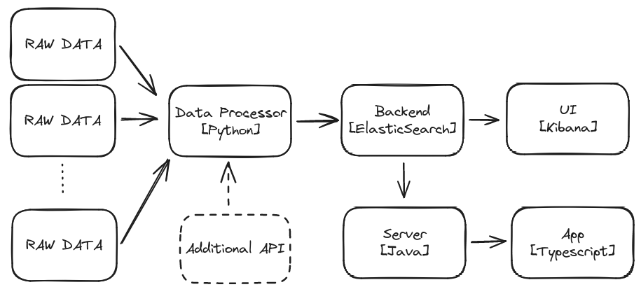

# EveStat - Measuring Moments, Maximizing Value

## Overview

EveStat is a tool for visualizing data related to events in Austria.

With this repository you get:
- An Application for viewing and comparing events
- An extensible backend for querying data
- A script for ingesting data
- A sample Kibana dashboard for quick results

## Data Flow

## Tech Stack

### Data Processor - Python 

I mean, Python was like created for those things

### Backend - ElasticSearch

- OpenSource
- Works well with time data
- Comes with nice UI

### UI - Kibana

- The nice UI for ElasticSearch

### Server - Java

- Provides possibility to use SpringBoot
    - Nice integration for ElasticSearch

### App - Typescript

- Because why use JavaScript?
- Nice Framework with VUE

## Quickstart - GitPod

- Open GitPod via the GitPod badge
- Run `docker-compose up`

> **_NOTE:_**  If you use a browser IDE, you will get a pop-up for the ports, if you use a local IDE, you can use localhost

## Quickstart - Local

- Clone the repository
- Run `docker-compose up`

> **_NOTE:_**  You need docker and docker-compose installed

## Ingesting Data

If you have a data set that you want to ingest into ElasticSearch, you can use the scripts provided under `./scripts`

## Predefined Dashboard

If you want to use the prefined dashboard, you can import the dashboards defined under `./kibana` in the Kibana UI.

## Report a bug

For filing bugs, suggesting improvements, or requesting new features, please open an issue.

## Roadmap

You can have a look at future plans in the `ROADMAP.md`

## License

The build project is under the MIT license.